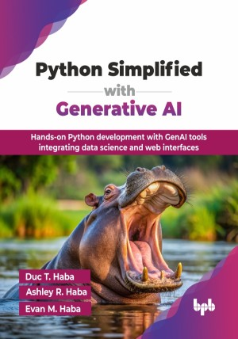

# Python Simplified with Generative AI

Hands-on Python development with GenAI tools integrating data science and web interfaces.

This is the repository for [Python Simplified with Generative AI
](https://bpbonline.com/products/building-generative-ai-applications-with-open-source-libraries-1?variant=44586760241352),published by BPB Publications.

## About the Book
GenAI and Python are changing how we use technology, making it essential to understand both to stay innovative and work efficiently. GenAI significantly impacts learning Python by generating personalized code snippets, accelerating the learning process. This book bridges the gap between traditional education and the practical challenges students encounter today. It combines hands-on learning with modern GenAI tools like GPT-4 and Copilot. 

The book begins with fundamental GenAI concepts, including GPT-4 and Gemini, and mastering prompt engineering for optimal GenAI interaction. Instead of starting with technical details like algorithms and syntax, it introduces coding through interactive, practical Python Jupyter Notebooks and Google Colab projects. Readers will learn Python code with a calculator application, explore fundamental sorting algorithms, and manipulate data using Pandas. The book then explores advanced ML through CNN image classification with Fast.ai, and deploying AI models as web applications using Hugging Face and Gradio. It also addresses critical ethical considerations in AI, focusing on fairness and bias, and provides career guidance for modern programmers. Moreover, this book takes a fresh approach to learning by prioritizing exploration and creativity, much like the way Gen Z engage with games, apps, and hands-on activities.

By the end of this book, you will be equipped with the practical skills and ethical understanding to confidently apply Python and GenAI in diverse projects, helping you navigate the evolving landscape of AI-driven development.

## What You Will Learn
• Write and debug Python code through hands-on projects.

• Learn GenAI setup, and effective prompt engineering.

• Step-by-step Python projects using Jupyter Notebooks and GenAI.

• Deploy AI models as interactive web applications using Hugging Face and Gradio frameworks.

• Leverage GenAI tools like GPT-4 and Copilot.
